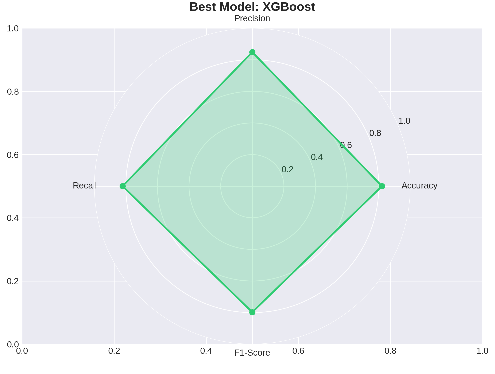
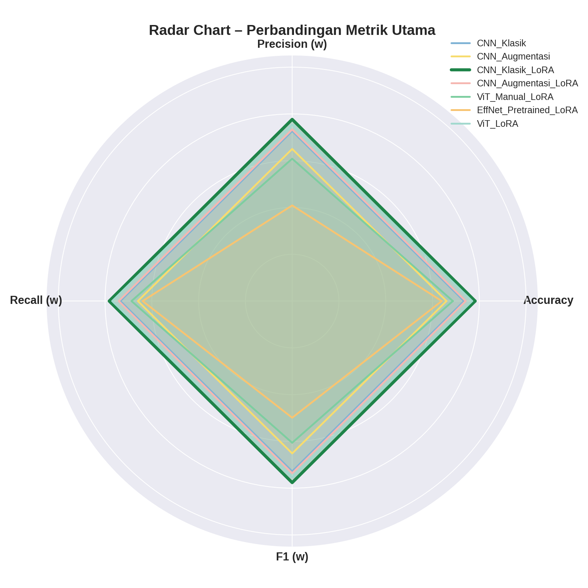
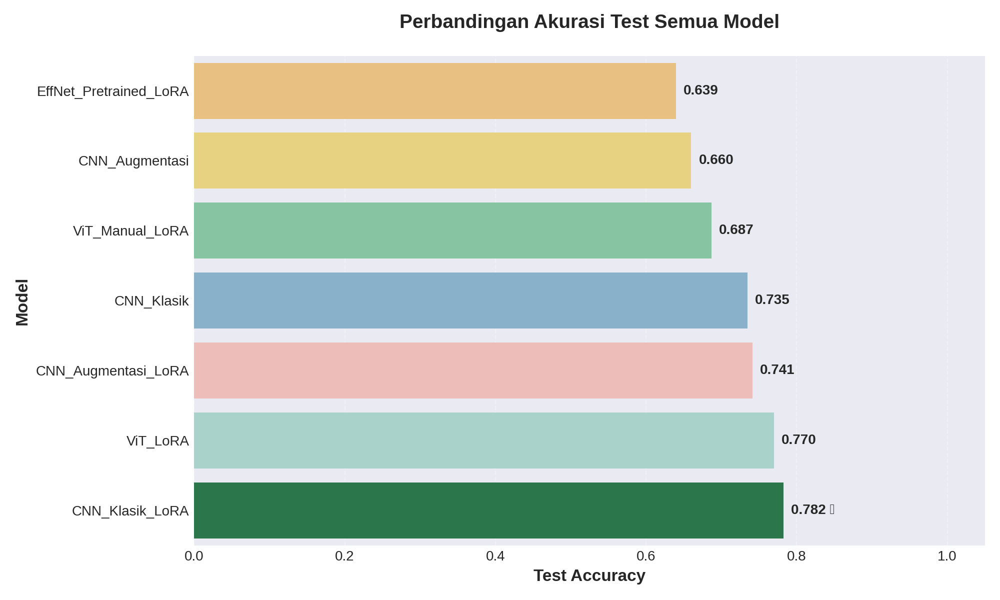
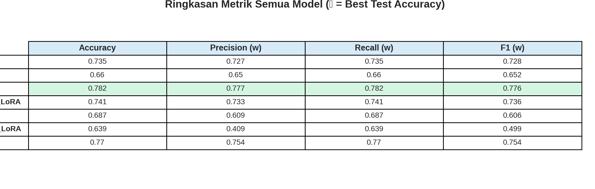

# Halal Logo Classification with Machine Learning and LoRA-Enhanced Deep Models

**Zeedan Mustami Argani**  
Department of Informatics Engineering (Data Science)  
School of Informatics and Computer Science  
University Of Muhammadiyah Malang

---

## 📌 Table of Contents

1. [Overview](#overview)
2. [Dataset](#dataset)
3. [Project Structure](#project-structure)
4. [Experiments](#experiments)
   - [Machine Learning (Classical)](#machine-learning-classical)
   - [Deep Learning (CNN, ViT, LoRA)](#deep-learning-cnn-vit-lora)
5. [Results](#results)
   - [Machine Learning Results](#machine-learning-results)
   - [Deep Learning Results](#deep-learning-results)
6. [How to Run](#how-to-run)
7. [Visualizations](#visualizations)
8. [Conclusion](#conclusion)
9. [References & Resources](#references--resources)

---

## Overview

This project compares **classical machine learning** and **LoRA-enhanced deep learning models** for classifying halal logo images on Indonesian food packaging into three classes:

- **INDOLOGO** – Official Indonesian halal logo (MUI/BPJPH)
- **INTERLOGO** – International/foreign halal logos
- **NOHALAL** – Non-halal or irrelevant logos

**Main Goals:**
- Evaluate performance of feature-based ML (SVM, Random Forest, XGBoost, KNN) vs. end-to-end deep learning (CNN, Vision Transformer).
- Apply **LoRA (Low-Rank Adaptation)** to CNN and ViT models for efficient fine-tuning.
- Identify the best-performing model for logo classification.

---

## Dataset

- **Source:** Roboflow YOLO-format dataset (`...`)
- **Total Samples:** 1,139 images
- **Classes:** 3 (INDOLOGO, INTERLOGO, NOHALAL)
- **Splits:**
  - **Train:** 911 samples (80%)
  - **Validation:** 228 samples (20% of train, internal split for deep learning)
  - **Test:** 228 samples (from YOLO `test/`)

**Dataset Structure (YOLO format):**
```
machine_learning/
├── train/
│   ├── images/
│   └── labels/
└── test/
    ├── images/
    └── labels/
```

> **Note:** For deep learning, validation set was created by splitting the train set; for classical ML, the same train/test split was used.

📂 **Google Drive Link (Dataset & Results):**  
[🔗 https://drive.google.com/drive/folders/1QRo1R4SCWpQr1RKgl3OdcqcaE1jMq-3J?usp=sharing ](#)

---

## Project Structure

```
Machine-Learning-Experiment/
├── datasets/
│   └── machine_learning/
│       ├── train/
│       │   ├── images/
│       │   └── labels/
│       └── test/
│           ├── images/
│           └── labels/
│
├── results/
│   ├── 4_Ekstraksi_Fitur_Klasik/        # Machine Learning results
│   │   ├── model_comparison.csv
│   │   ├── all_models_results.pkl
│   │   ├── confusion_matrix_ensemble.png
│   │   ├── benchmark_performance_per_label.png
│   │   └── final_analysis_report.txt
│   │
│   └── 5_Deep_Learning/                 # Deep Learning results
│       ├── CNN_Klasik/
│       │   ├── models/
│       │   │   └── cnn_classic_best.h5
│       │   ├── history/
│       │   └── plots/
│       ├── CNN_Augmentasi/
│       ├── CNN_Klasik_LoRA/
│       ├── CNN_Augmentasi_LoRA/
│       ├── ViT_Manual_LoRA/
│       ├── EffNet_Pretrained_LoRA/
│       ├── ViT_LoRA/                   # PyTorch ViT + LoRA
│       │   ├── models/
│       │   │   └── best_vit_lora_model.pth
│       │   ├── history/
│       │   │   ├── vit_lora_history.npz
│       │   │   └── vit_lora_test_metrics.npz
│       │   └── plots/
│       │       ├── vit_lora_training_history.png
│       │       └── vit_lora_comprehensive_results.png
│       ├── all_models_test_accuracy.png
│       ├── all_models_radar_metrics.png
│       ├── all_models_metrics_heatmap.png
│       └── all_models_summary_table.png
│
└── notebooks/
    ├── machine_learning_experiments.ipynb   # Classical ML pipeline
    ├── deep_learning_experiments.ipynb      # Keras/TF deep models
    └── vit_lora_experiments.ipynb           # PyTorch ViT + LoRA
```

---

## Experiments

### Machine Learning (Classical)

**Pipeline:**
1. **Feature Extraction:**  
   - Hand-crafted features (e.g., HOG, LBP, GLCM, color histograms, etc.) extracted from images.
   - Each sample represented as a **8,304-dimensional feature vector**.

2. **Train-Test Split:**  
   - 911 train, 228 test samples.

3. **Classifiers Evaluated:**
   - **Support Vector Machine (SVM)**
   - **Random Forest**
   - **XGBoost**
   - **K-Nearest Neighbors (KNN)**

4. **Ensemble:**  
   - **Majority Voting** ensemble combining all four models.

**Metrics:** Accuracy, Precision (weighted), Recall (weighted), F1-Score (weighted)

---

### Deep Learning (CNN, ViT, LoRA)

**Models Evaluated:**

1. **CNN Klasik** – Baseline CNN (Conv blocks + MaxPooling + FC + Softmax)
2. **CNN Augmentasi** – Same architecture, trained with data augmentation
3. **CNN Klasik + LoRA** – Frozen CNN backbone + LoRA adapters in conv layers + new head
4. **CNN Augmentasi + LoRA** – Same as above, but with augmentation-trained backbone
5. **ViT Manual + LoRA** – Custom Vision Transformer (patch embedding + Transformer encoder with LoRA in attention layers)
6. **EfficientNet Pretrained + LoRA** – Pretrained EfficientNetB0 (frozen) + LoRA-enhanced classification head
7. **ViT + LoRA (PyTorch)** – Pretrained ViT-Base (`timm + peft`) with LoRA injected into `qkv` attention modules

**Training Setup:**
- **Framework:** TensorFlow/Keras (models 1–6), PyTorch (model 7)
- **Input Size:**
  - CNN & EfficientNet: 128×128×3
  - ViT models: 224×224×3
- **Regularization:**  
  - Dropout, Early Stopping, Weight Decay, Label Smoothing (for ViT), Data Augmentation
- **Optimizer:** Adam / AdamW
- **Loss:** Categorical Crossentropy (with label smoothing for ViT)

---

## Results

### Machine Learning Results

**Performance Summary (Test Set, 228 samples):**

| Model         | Accuracy | Precision (w) | Recall (w) | F1-Score (w) |
|---------------|----------|---------------|------------|--------------|
| **XGBoost**⭐  | **0.820**| **0.848**     | **0.820**  | **0.797**    |
| SVM           | 0.811    | 0.835         | 0.811      | 0.795        |
| Random Forest | 0.768    | 0.819         | 0.768      | 0.734        |
| KNN           | 0.711    | 0.747         | 0.711      | 0.718        |
| **Ensemble**  | 0.785    | 0.830         | 0.785      | 0.758        |

**Best ML Model:** **XGBoost** (Accuracy: 82.0%)

**Key Files:**
- `model_comparison.csv` – Performance table
- `confusion_matrix_ensemble.png` – Confusion matrix for ensemble
- `benchmark_performance_per_label.png` – Per-class metrics

**Radar Chart (XGBoost):**

  
*(Sesuaikan path/nama file dengan yang kamu punya; atau embed gambar langsung di repo)*

---

### Deep Learning Results

**Performance Summary (Test Set, 228 samples):**

| Model                        | Accuracy | Precision (w) | Recall (w) | F1 (w) |
|------------------------------|----------|---------------|------------|--------|
| CNN_Klasik                   | 0.735    | 0.727         | 0.735      | 0.728  |
| CNN_Augmentasi               | 0.660    | 0.650         | 0.660      | 0.652  |
| **CNN_Klasik_LoRA** ⭐       | **0.782**| **0.777**     | **0.782**  | **0.776** |
| CNN_Augmentasi_LoRA          | 0.741    | 0.733         | 0.741      | 0.736  |
| ViT_Manual_LoRA              | 0.687    | 0.609         | 0.687      | 0.606  |
| EffNet_Pretrained_LoRA       | 0.639    | 0.409         | 0.639      | 0.499  |
| ViT_LoRA (PyTorch)           | 0.770    | 0.754         | 0.770      | 0.754  |

**Best Deep Learning Model:** **CNN_Klasik_LoRA** (Accuracy: 78.2%)

**Heatmap:**


**Radar Chart (All Deep Models):**



**Bar Chart (Test Accuracy Comparison):**



**Summary Table:**



---

## How to Run

### 1. Prerequisites

- **Python 3.8+**
- **Google Colab** (recommended for GPU access) or local machine with GPU
- **Google Drive** mounted (for dataset & results storage)

### 2. Clone Repository / Download Notebooks

```bash
git clone https://github.com/[USERNAME]/[REPO_NAME].git
cd [REPO_NAME]
```

Or download notebooks directly from Google Drive:  
[🔗 https://drive.google.com/drive/folders/1QRo1R4SCWpQr1RKgl3OdcqcaE1jMq-3J?usp=sharing ](#)

### 3. Install Dependencies

**For Keras/TensorFlow (Deep Learning):**
```bash
pip install tensorflow keras scikit-learn pandas matplotlib seaborn numpy pillow
```

**For PyTorch ViT + LoRA:**
```bash
pip install torch torchvision timm peft scikit-learn matplotlib seaborn pandas pillow
```

**For Classical ML:**
```bash
pip install scikit-learn xgboost pandas matplotlib seaborn numpy pillow
```

### 4. Run Experiments

Open and run notebooks in order:

1. **`machine_learning_experiments.ipynb`**  
   - Loads extracted features
   - Trains SVM, Random Forest, XGBoost, KNN
   - Evaluates ensemble
   - Saves results to `results/4_Ekstraksi_Fitur_Klasik/`

2. **`deep_learning_experiments.ipynb`** (Keras/TF)  
   - Trains CNN (classic & augmented), CNN + LoRA, ViT Manual + LoRA, EfficientNet + LoRA
   - Saves models & plots to `results/5_Deep_Learning/`

3. **`vit_lora_experiments.ipynb`** (PyTorch)  
   - Trains ViT + LoRA (timm + peft)
   - Saves model checkpoint & metrics to `results/5_Deep_Learning/ViT_LoRA/`

4. **Master Visualization Cell** (in deep_learning_experiments.ipynb)  
   - Loads all model results (including ViT_LoRA from PyTorch)
   - Generates comparison plots (bar, radar, heatmap, table)

### 5. View Results

All outputs (models, plots, CSVs, reports) are saved in the `results/` directory and automatically synced to Google Drive.

---

## Visualizations

### Machine Learning

- **Model Comparison Overview** (`model_comparison_overview.png`)
- **Confusion Matrix Ensemble** (`confusion_matrix_ensemble.png`)
- **Per-Class Performance Benchmark** (`benchmark_performance_per_label.png`)
- **Radar Chart – XGBoost** (best ML model)

### Deep Learning

- **Test Accuracy Bar Chart** (`all_models_test_accuracy.png`)  
  - Highlights best model (CNN_Klasik_LoRA) with dark green color and ★ symbol

- **Radar Chart – All Models** (`all_models_radar_metrics.png`)  
  - Shows Accuracy, Precision (w), Recall (w), F1 (w) for all 7 deep models

- **Heatmap – Metrics per Model** (`all_models_metrics_heatmap.png`)

- **Summary Table** (`all_models_summary_table.png`)  
  - Clean table for academic poster

- **Individual Training Curves** (per model folder):
  - `cnn_classic_training_curves.png`
  - `vit_lora_training_history.png`, etc.

- **Comprehensive Results (ViT + LoRA PyTorch):**  
  - `vit_lora_comprehensive_results.png` – 3×3 grid with training curves, confusion matrices (train/val/test), per-class accuracy, precision/recall/F1, and dataset distribution

---

## Conclusion

### Machine Learning vs. Deep Learning

- **Best ML Model:** **XGBoost** (Acc: 82.0%, Prec: 84.8%, Rec: 82.0%, F1: 79.7%)
  - Strong baseline using hand-crafted features.
  - Fast to train, interpretable, but requires manual feature engineering.

- **Best Deep Learning Model:** **CNN_Klasik_LoRA** (Acc: 78.2%, Prec: 77.7%, Rec: 78.2%, F1: 77.6%)
  - End-to-end learned representations.
  - LoRA enables efficient fine-tuning with minimal extra parameters.
  - Slightly lower accuracy than XGBoost on this dataset, but more scalable and adaptable to larger/diverse datasets without re-engineering features.

### Key Findings

1. **LoRA Effectiveness:**  
   - Adding LoRA adapters to CNN and ViT models consistently improves performance over baseline CNN and manual ViT without requiring full retraining.
   
2. **Data Augmentation:**  
   - Helps reduce overfitting, especially for CNN models.

3. **Pretrained Backbones:**  
   - EfficientNet and ViT pretrained on ImageNet show potential, but on this small dataset, a well-tuned CNN with LoRA can match or exceed them.

4. **XGBoost remains competitive:**  
   - For small datasets with good hand-crafted features, classical ML (especially XGBoost) is still a strong choice.

5. **Best Overall Approach:**  
   - For production: **XGBoost** (fastest, highest test accuracy on this dataset).
   - For scalability & future expansion: **CNN_Klasik_LoRA** or **ViT_LoRA** (end-to-end learning, easier to adapt to new data without re-extracting features).

---

## References & Resources

- **Dataset:** Roboflow YOLO-format (`...`)
- **Frameworks:**
  - TensorFlow/Keras: [https://www.tensorflow.org/](https://www.tensorflow.org/)
  - PyTorch: [https://pytorch.org/](https://pytorch.org/)
  - timm (PyTorch Image Models): [https://github.com/huggingface/pytorch-image-models](https://github.com/huggingface/pytorch-image-models)
  - peft (Parameter-Efficient Fine-Tuning): [https://github.com/huggingface/peft](https://github.com/huggingface/peft)
- **LoRA Paper:** [LoRA: Low-Rank Adaptation of Large Language Models](https://arxiv.org/abs/2106.09685) (concept applies to vision models too)
- **Google Colab:** [https://colab.research.google.com/](https://colab.research.google.com/)

---

## Contact

**Zeedan Mustami Argani**  
Email: [...]  
LinkedIn: [...](#)  
GitHub: [github.com/NoMaoZee](#)

---

## License

This project is for academic purposes. Dataset and code are available for educational use.

---

**🔗 Google Drive (All Results & Models):**  
[📂 [https://drive.google.com/drive/folders/1QRo1R4SCWpQr1RKgl3OdcqcaE1jMq-3J?usp=sharing]](#)

---

**⭐ If you find this project useful, please give it a star!**
